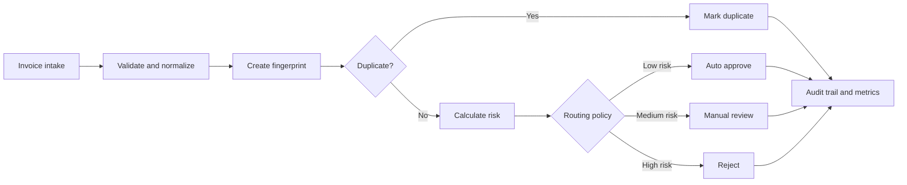

# Invoice Automation API

An auditable FastAPI service that turns invoice intake into a deterministic workflow: validate data, detect duplicates, calculate risk, choose a review path, and expose operational metrics.

The project demonstrates the backend decisions behind enterprise document automation without hiding business rules inside a black box.

## What it includes

- Strict request validation and currency controls
- SHA-256 duplicate detection
- Explainable risk scoring with an audit trail
- Automatic approval, manual review, rejection, and duplicate routes
- Aggregate processing metrics
- Thread-safe in-memory persistence for the demo
- Tests, linting, Docker, Dependabot, and GitHub Actions

## Architecture



## Run locally

```bash
python -m venv .venv
# Windows: .venv\Scripts\activate
# macOS/Linux: source .venv/bin/activate
pip install -r requirements-dev.txt
uvicorn app.main:app --reload
```

Open `http://127.0.0.1:8000/docs` for the interactive API.

## Example

```bash
curl -X POST http://127.0.0.1:8000/invoices \
  -H "Content-Type: application/json" \
  -d '{
    "vendor_name": "Acme Cloud Services",
    "invoice_number": "INV-2026-1042",
    "po_number": "PO-8821",
    "amount": "2499.00",
    "currency": "USD",
    "due_date": "2026-11-15"
  }'
```

Every response contains the selected status, risk score, duplicate link when applicable, and a step-by-step audit trail.

## Routing policy

| Condition | Risk effect | Route |
| --- | ---: | --- |
| Complete low-value invoice | 0 | Auto approve |
| Missing purchase order | +30 | Manual review |
| Amount above 10,000 | +30 | Manual review |
| Overdue invoice | +20 | Depends on total score |
| Amount above 250,000 or score at least 70 | Up to 100 | Reject |
| Existing fingerprint | N/A | Duplicate |

The thresholds are intentionally centralized in the pipeline so they can be replaced by configuration or a policy service.

## Test and lint

```bash
ruff check .
python -m pytest -q
```

## Docker

```bash
docker build -t invoice-automation-api .
docker run --rm -p 8000:8000 invoice-automation-api
```

## Production extensions

For a real deployment, add authenticated tenant boundaries, PostgreSQL persistence, encrypted document storage, idempotency keys, OCR/provider adapters, configurable approval policies, event delivery, observability, and human-review queues.

## License

No license has been selected. All rights are reserved unless a license is added later.
